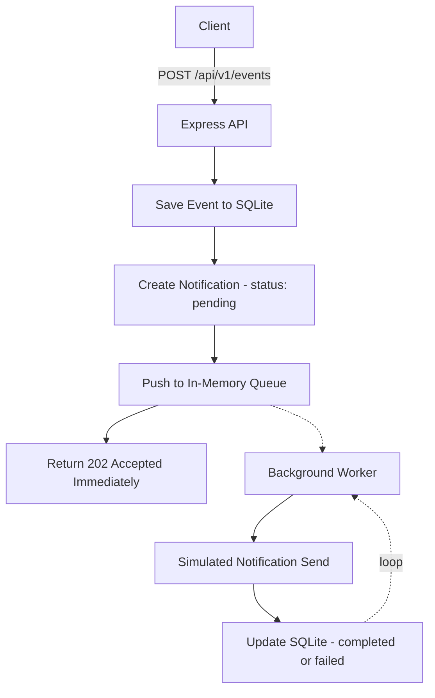

# Event-Driven Notification Dispatcher

A lightweight, asynchronous notification dispatch system built with **Node.js**, **Express.js**, and **SQLite**. It accepts business events over HTTP, persists them immediately, and processes notifications in the background using a native in-memory queue — no Redis, RabbitMQ, Kafka, or BullMQ required.

---

## Project Overview

When a business event occurs (e.g. `order_placed`), this service:

1. Validates and persists the event.
2. Creates a `pending` notification record tied to that event.
3. Enqueues the notification onto an in-memory queue.
4. Responds **immediately** with `202 Accepted` — the HTTP request never waits on delivery.
5. A background worker continuously drains the queue, simulates sending the notification (random delay + a chance of failure), and updates the notification's final status (`completed` or `failed`) in SQLite.

This mirrors the shape of a real production notification pipeline (API → durable store → queue → worker) while staying dependency-light enough to run anywhere Node.js runs.

---

## Live Demo

The project is deployed on [Render](https://render.com):

**Base URL:** `https://notification-dispatcher.onrender.com`

Try it directly:

```bash
curl -X POST https://notification-dispatcher.onrender.com/api/v1/events \
  -H "Content-Type: application/json" \
  -d '{
    "event_type": "order_placed",
    "recipient": "user@example.com",
    "data": { "order_id": 101 }
  }'
```

```bash
curl https://notification-dispatcher.onrender.com/api/v1/notifications/1
curl https://notification-dispatcher.onrender.com/api/v1/events
curl https://notification-dispatcher.onrender.com/health
```

> **Note:** if this is running on Render's free tier, the service spins down after periods of inactivity. The first request after idling can take 30–60 seconds while the instance cold-starts — subsequent requests are fast. Also note that Render's free tier uses an ephemeral filesystem, so the SQLite database resets on every redeploy or restart unless a persistent disk is attached.

---

## Features

- `POST /api/v1/events` endpoint with request validation
- Non-blocking `202 Accepted` response — decoupled from background processing
- Native in-memory FIFO queue (no external broker)
- Background worker loop started automatically on server boot
- Simulated notification delivery: 500–1000ms random delay, 10% simulated failure rate
- Automatic `retry_count` tracking on failed notifications
- SQLite persistence for both events and notifications
- Clean, layered architecture (routes → controllers → services → db)
- Centralized error handling middleware
- Structured, readable console logging at every stage of the pipeline

---

## Tech Stack

| Concern            | Choice                          |
|--------------------|----------------------------------|
| Runtime            | Node.js                          |
| HTTP framework     | Express.js                       |
| Database           | SQLite (via `sqlite3`)           |
| Queue              | Native JavaScript array (FIFO)   |
| Background worker  | Async loop (`while` + `await`)   |
| Config             | `dotenv`                         |
| Dev tooling        | `nodemon`                        |

---

## Folder Structure

```
project-root/
├── src/
│   ├── app.js                     # Express app config (middleware, routes, error handler)
│   ├── server.js                  # Entry point: boots DB, worker, and HTTP server
│   │
│   ├── controllers/
│   │   └── eventController.js     # Validates requests, calls services, shapes HTTP responses
│   │
│   ├── routes/
│   │   └── eventRoutes.js         # Route definitions only
│   │
│   ├── services/
│   │   ├── eventService.js        # Insert event, create notification, enqueue task
│   │   ├── notificationService.js # Update notification status / retry_count
│   │   └── queueWorker.js         # Background loop: dequeue, simulate send, persist result
│   │
│   ├── queue/
│   │   └── notificationQueue.js   # In-memory FIFO queue (enqueue/dequeue)
│   │
│   ├── db/
│   │   ├── database.js            # SQLite connection + promisified run/get/all helpers
│   │   └── schema.sql             # Table definitions
│   │
│   ├── middleware/
│   │   └── errorHandler.js        # Centralized error handling
│   │
│   └── utils/
│       └── randomDelay.js         # Random delay helper for simulated sends
│
├── README.md
├── package.json
├── .env.example
└── architecture-diagram.png
```

---

## Installation

```bash
git clone <this-repo>
cd project-root
npm install
cp .env.example .env
```

> **Note on `sqlite3`**: this package compiles a native binary on install. This requires a working internet connection and, on some systems, build tools (`python3`, a C++ compiler). If you hit native build errors, the two most common fixes are:
> - Ensure you have a recent Node.js LTS version installed.
> - Run `npm install` with network access to `nodejs.org` (used to download Node headers for the native build) and npm's registry.

---

## Running the Project

```bash
# Production
npm start

# Development (auto-restart on file changes)
npm run dev
```

On startup you should see:

```
[DATABASE] Connected to SQLite at ./data/dispatcher.db
[DATABASE] Schema ready (events, notifications)
[WORKER] Background notification worker started
[SERVER] Started on http://localhost:3000
```

---

## API Documentation

### `POST /api/v1/events`

Accepts a business event and returns immediately, without waiting for notification delivery.

**Request body**

| Field        | Type   | Required | Description                          |
|--------------|--------|----------|--------------------------------------|
| `event_type` | string | yes      | Name of the business event           |
| `recipient`  | string | yes      | Notification recipient (e.g. email)  |
| `data`       | object | no       | Arbitrary event payload              |

**Validation**

- `event_type` and `recipient` are required. Missing either returns:

```json
HTTP 400
{
  "error": "event_type and recipient are required"
}
```

**Success response**

```json
HTTP 202 Accepted
{
  "message": "Event accepted for processing",
  "tracking_id": 1,
  "notification_id": 1,
  "status": "pending"
}
```

- `tracking_id` — the created event's id
- `notification_id` — the created notification's id (poll the DB directly to check its final status)

### `GET /api/v1/events/:id`

Returns a single event along with every notification created for it.

**Success response**

```json
HTTP 200
{
  "id": 1,
  "event_type": "order_placed",
  "payload": { "recipient": "user@example.com", "data": { "order_id": 101 } },
  "created_at": "2026-07-02T07:19:03.314Z",
  "notifications": [
    {
      "id": 1,
      "event_id": 1,
      "recipient": "user@example.com",
      "channel": "email",
      "status": "completed",
      "retry_count": 0,
      "created_at": "2026-07-02T07:19:03.335Z",
      "updated_at": "2026-07-02T07:19:03.335Z"
    }
  ]
}
```

**Error responses**

| Condition                | Response                                             |
|---------------------------|-------------------------------------------------------|
| `id` not a positive integer | `400 { "error": "id must be a positive integer" }` |
| Event doesn't exist        | `404 { "error": "Event <id> not found" }`           |

### `GET /api/v1/events`

Returns a paginated list of events (most recent first), each with its notifications attached.

**Query params**

| Param    | Default | Notes                          |
|----------|---------|---------------------------------|
| `limit`  | `50`    | capped at `200`                |
| `offset` | `0`     | for paging through older events |

```json
HTTP 200
{
  "count": 2,
  "limit": 50,
  "offset": 0,
  "events": [ { "...": "same shape as GET /events/:id" } ]
}
```

### `GET /api/v1/notifications/:id`

Returns a single notification, most useful for polling delivery status after receiving `tracking_id`/`notification_id` from `POST /api/v1/events`.

```json
HTTP 200
{
  "id": 1,
  "event_id": 1,
  "recipient": "user@example.com",
  "channel": "email",
  "status": "completed",
  "retry_count": 0,
  "created_at": "2026-07-02T07:19:03.335Z",
  "updated_at": "2026-07-02T07:19:03.335Z"
}
```

`404 { "error": "Notification <id> not found" }` if it doesn't exist.

### `GET /api/v1/notifications`

Returns a paginated list of notifications, most recent first, optionally filtered by status.

**Query params**

| Param    | Default | Notes                                             |
|----------|---------|-----------------------------------------------------|
| `status` | none    | one of `pending`, `completed`, `failed`             |
| `limit`  | `50`    | capped at `200`                                    |
| `offset` | `0`     | for paging                                          |

Invalid `status` values return `400 { "error": "status must be one of: pending, completed, failed" }`.

```json
HTTP 200
{
  "count": 1,
  "limit": 50,
  "offset": 0,
  "notifications": [ { "...": "same shape as GET /notifications/:id" } ]
}
```

### `GET /health`

Simple liveness check, returns `{ "status": "ok" }`.

---

## Sample Request

```bash
curl -X POST http://localhost:3000/api/v1/events \
  -H "Content-Type: application/json" \
  -d '{
    "event_type": "order_placed",
    "recipient": "user@example.com",
    "data": { "order_id": 101 }
  }'
```

> Swap `http://localhost:3000` for `https://notification-dispatcher.onrender.com` to hit the live deployment instead — see [Live Demo](#live-demo) above.

## Sample Response

```json
{
  "message": "Event accepted for processing",
  "tracking_id": 1,
  "notification_id": 1,
  "status": "pending"
}
```

Console output shortly after (from the background worker):

```
[QUEUE] Notification Added -> notification_id=1, event_id=1
[WORKER] Processing Notification -> notification_id=1, recipient=user@example.com, channel=email
[WORKER] Notification Completed -> notification_id=1
```

You can then poll for the final delivery status using the `notification_id` returned above:

```bash
curl http://localhost:3000/api/v1/notifications/1
```

```json
{
  "id": 1,
  "event_id": 1,
  "recipient": "user@example.com",
  "channel": "email",
  "status": "completed",
  "retry_count": 0,
  "created_at": "2026-07-02T07:19:03.335Z",
  "updated_at": "2026-07-02T07:19:03.335Z"
}
```

---

## Queue Working

- The queue (`src/queue/notificationQueue.js`) is a plain JavaScript array wrapped with `enqueue()` / `dequeue()` methods — a simple FIFO structure with no external dependency.
- `eventService.createEventAndNotification()` pushes a task onto the queue right after the `pending` notification row is created, **before** the HTTP response is sent.
- `queueWorker.js` runs an infinite `async` loop started once at server boot. On each iteration it:
  1. Checks whether the queue is empty; if so, it sleeps briefly (200ms) and checks again.
  2. Otherwise, dequeues the oldest task and processes it: waits a random 500–1000ms delay (`utils/randomDelay.js`), then simulates a 10% chance of failure using `Math.random() < 0.1`.
  3. Persists the outcome via `notificationService.markCompleted()` or `markFailed()` (the latter also increments `retry_count`).
- Because the worker loop and the HTTP server both run on Node's single event loop, `await`s inside the worker yield control back to the event loop between steps — incoming HTTP requests are never blocked by queue processing.

---

## Database Schema

**events**

```sql
CREATE TABLE events (
  id INTEGER PRIMARY KEY AUTOINCREMENT,
  event_type TEXT NOT NULL,
  payload TEXT NOT NULL,
  created_at DATETIME DEFAULT CURRENT_TIMESTAMP
);
```

**notifications**

```sql
CREATE TABLE notifications (
  id INTEGER PRIMARY KEY AUTOINCREMENT,
  event_id INTEGER NOT NULL,
  recipient TEXT NOT NULL,
  channel TEXT NOT NULL,
  status TEXT NOT NULL CHECK(status IN ('pending','completed','failed')),
  retry_count INTEGER DEFAULT 0,
  created_at DATETIME DEFAULT CURRENT_TIMESTAMP,
  updated_at DATETIME DEFAULT CURRENT_TIMESTAMP,
  FOREIGN KEY(event_id) REFERENCES events(id)
);
```

`channel` defaults to `"email"` for every notification created by this API.

---

## Architecture Explanation

The system is deliberately split into two paths:

- **Synchronous path** (inside the HTTP request/response cycle): validate → save event → create notification → enqueue → respond `202`. This path is fast and does no I/O beyond two SQLite writes.
- **Asynchronous path** (outside the request/response cycle): the background worker dequeues, simulates delivery, and writes the final status back to SQLite. This path can take up to a second per notification without ever affecting API latency.

See `architecture-diagram.png` for a visual walkthrough, and the Mermaid diagram below for the same flow in text form:



Layering follows a standard clean-architecture split:

- **Routes** — HTTP path/verb wiring only.
- **Controllers** — request validation and response shaping; no SQL.
- **Services** — all business logic (`eventService`, `notificationService`, `queueWorker`).
- **Queue** — a pure, dependency-free data structure.
- **DB layer** — the only module that talks SQL; exposes generic `run/get/all` helpers.
- **Middleware** — cross-cutting concerns (centralized error handling).

---

## Error Handling

| Scenario                     | Response                                             |
|-------------------------------|-------------------------------------------------------|
| Missing `event_type`          | `400 { "error": "event_type and recipient are required" }` |
| Missing `recipient`           | `400 { "error": "event_type and recipient are required" }` |
| Malformed JSON body           | `400 { "error": "Invalid JSON payload" }`            |
| Database insert/update failure| `500 { "error": "Internal server error" }` (logged with stack trace) |
| Unmatched route               | `404 { "error": "Route not found" }`                 |
| Any other unhandled exception | `500 { "error": "Internal server error" }`           |

All controller logic is wrapped in `try/catch` and forwards errors to Express's centralized `errorHandler` middleware via `next(err)`, so no error path can leak an unhandled promise rejection or crash the process.

---

## Assumptions

- Each event produces exactly one notification (fan-out to multiple channels is out of scope but the schema supports it).
- `channel` is always `"email"` for now — no channel selection logic was requested.
- The queue is purely in-memory: if the process restarts, any notifications still `pending` in SQLite that were not yet processed will **not** automatically re-enqueue (see Future Improvements).
- Single-worker, sequential processing was chosen for predictability and to satisfy the "no external queue" constraint; throughput is bounded by the 500–1000ms simulated delay per notification.
- No authentication/authorization was requested, so the API is unauthenticated by design.

---

## Future Improvements

- **Startup recovery**: on boot, re-enqueue any notifications still in `pending` status so the queue survives process restarts.
- **Retry backoff**: automatically re-enqueue `failed` notifications up to a max `retry_count` with exponential backoff.
- **Concurrency**: process multiple notifications in parallel (bounded worker pool) instead of strictly sequential dequeueing.
- **Real delivery providers**: swap the simulated send in `queueWorker.js` for a real email/SMS provider integration.
- **Observability**: structured JSON logging, request IDs, and metrics (queue depth, processing latency, failure rate).
- **Tests**: add unit tests for services and an integration test suite for the API using a temporary SQLite file.
- **Filtering/sorting on GET endpoints**: add `event_type` filtering on `GET /api/v1/events` and date-range filtering, similar to the `status` filter already available on `GET /api/v1/notifications`.
- **Persistent storage in deployment**: attach a persistent disk (or move to a managed Postgres/SQLite-compatible store) so data survives redeploys on platforms with ephemeral filesystems like Render's free tier.
